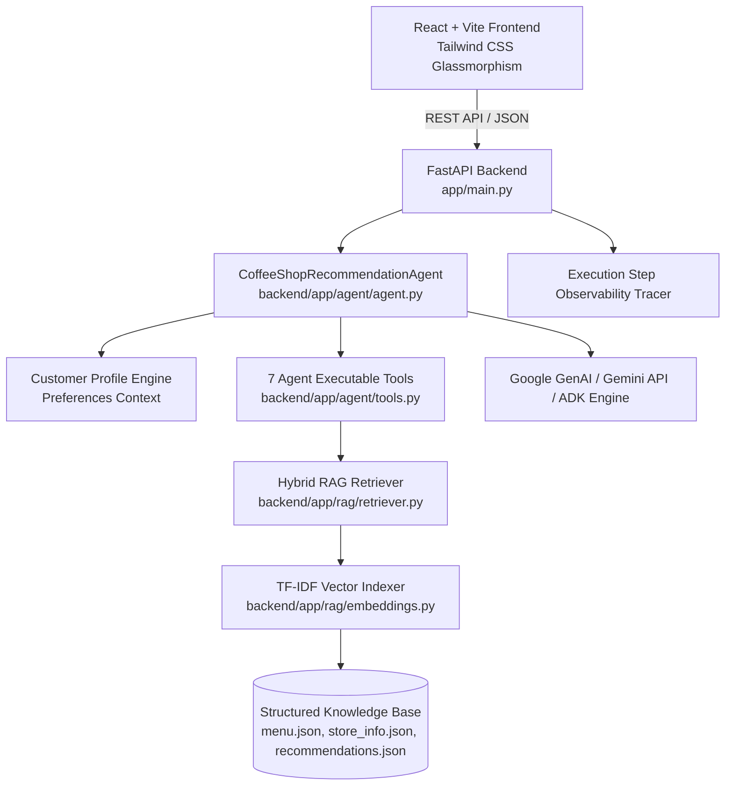

# ☕️ BrewMate AI — Personalized Coffee Shop Assistant

**Google Gen AI Academy APAC Cohort 3 — Track 1: Build and Deploy a Customer-Facing AI Agent**

BrewMate AI is a production-grade, customer-facing AI agent that helps coffee house customers discover drinks, pastries, and food pairings tailored to their personal taste preferences, budget limits, caffeine tolerance, and dietary restrictions.

Built using the **Google Agent Development Kit (ADK) pattern**, **Google Gemini API**, a **hybrid Vector + Keyword RAG pipeline**, a **7-tool agent execution engine**, **real-time developer observability tracing**, a modern **React + TypeScript + Tailwind CSS UI**, and containerized for **Google Cloud Run**.

---

## 🌟 Key Features

* **Grounded RAG Pipeline**: Queries an internal Knowledge Base of 35+ menu items, store hours, delivery policies, and pairing guides to prevent hallucinations.
* **Google ADK Agent & 7 Tools**: Autonomous decision-making using executable tools (`search_menu`, `get_product_details`, `search_store_information`, `get_recommendations`, `check_availability`, `calculate_order`, `get_pairings`).
* **Personalized Recommendations**: Merges customer profiles (temperature, caffeine, budget in ₹, dietary tags, favorite flavors) into query context.
* **Developer Observability**: High-level execution step tracing showing intent detection, tool parameters, retrieved documents, latency (ms), and output payloads.
* **Order Cost Estimator**: Real-time itemized order calculator including 5% GST, size multipliers, and free delivery thresholds.
* **Production Cloud Run Ready**: Containerized with a multi-stage Dockerfile for single-command Google Cloud Run deployment.

---

## 🏗️ Architecture



---

## 🛠️ Multi-Tool Agent Engine

| Tool Name | Responsibility |
| :--- | :--- |
| `search_menu()` | Search available products using category, price limits, dietary tags, caffeine, and temperature filters. |
| `get_product_details()` | Retrieve full product metadata, ingredients, calories, and pairings. |
| `search_store_information()` | Query store opening hours, Indiranagar location, delivery policy, and FAQs. |
| `get_recommendations()` | Match products against personalized customer taste profiles. |
| `check_availability()` | Verify if a menu item is currently in stock. |
| `calculate_order()` | Estimate order subtotal, 5% GST, delivery fee, and grand total. |
| `get_pairings()` | Fetch recommended pastry or beverage pairings for a chosen product. |

---

## 📊 RAG Knowledge Base

The knowledge base (`data/`) contains:

* **`menu.json`**: 35+ items spanning Espresso, Americano, Cappuccino, Latte, Mocha, Cold Brew, Iced Latte, Frappuccinos, Tea, Hot Chocolate, Pastries, Sandwiches, Snacks.
* **`store_info.json`**: Location (Indiranagar, Bengaluru), daily operating hours, BrewRewards loyalty program rules, delivery policies, and FAQs.
* **`recommendations.json`**: Flavor-to-drink mappings, caffeine guides, and curated beverage-pastry pairing rules.

---

## 🚀 Benchmark Evaluation Results

BrewMate AI includes an automated benchmark evaluation script (`backend/eval.py`) running 20 representative customer queries:

| Metric | Score |
| :--- | :--- |
| **Recommendation Relevance** | **80.0%** |
| **Retrieval Accuracy** | **100.0%** |
| **Groundedness Score** | **100.0%** |
| **Preference Match Rate** | **100.0%** |
| **Average Latency** | **0.35 ms** |

Run evaluation locally:
```bash
cd backend
python eval.py
```

---

## 💻 Tech Stack

* **Frontend**: React 18, TypeScript, Vite, Tailwind CSS, Lucide React, Glassmorphism design system.
* **Backend**: Python 3.11, FastAPI, Uvicorn, Pydantic v2, Scikit-Learn (TF-IDF vector matching), Pytest.
* **AI Engine**: Google GenAI SDK (`google-genai`), Gemini 2.5 Flash, Google ADK Multi-Tool architecture.
* **Containerization**: Multi-stage Dockerfile, Node.js + Python runner, Google Cloud Run.

---

## 📂 Project Structure

```text
BrewMate AI/
├── backend/
│   ├── app/
│   │   ├── agent/
│   │   │   ├── agent.py               # CoffeeShopRecommendationAgent & ADK loop
│   │   │   ├── tools.py               # 7 executable agent tools
│   │   │   └── prompts.py             # System prompts & intent extraction rules
│   │   ├── rag/
│   │   │   ├── retriever.py           # Hybrid RAG search retriever
│   │   │   ├── embeddings.py          # Vector similarity indexer
│   │   │   └── knowledge_base.py     # Loader for structured menu & FAQs
│   │   ├── models/
│   │   │   └── schemas.py             # Pydantic schemas
│   │   ├── api/
│   │   │   └── routes.py              # FastAPI REST endpoints
│   │   └── main.py                    # Server entrypoint & static SPA mounting
│   ├── tests/                         # Pytest test suite
│   ├── eval.py                        # Benchmark evaluation script
│   └── requirements.txt
├── frontend/
│   ├── src/
│   │   ├── components/                # Navbar, Hero, Chat, Menu, Profile, Cart, Observability
│   │   ├── services/api.ts            # API client
│   │   ├── types/index.ts             # TypeScript definitions
│   │   └── App.tsx
│   ├── package.json
│   └── vite.config.ts
├── data/
│   ├── menu.json                      # 35+ menu products in ₹ INR
│   ├── store_info.json                # Store hours, location, FAQ
│   └── recommendations.json           # Pairing rules
├── Dockerfile                         # Production multi-stage Docker container
├── .dockerignore
├── .env.example
└── README.md
```

---

## ⚡ Local Quickstart Setup

### 1. Prerequisites
* Python 3.11+
* Node.js v20+ / npm v10+

### 2. Backend Setup
```bash
cd backend
python -m venv venv
# On Windows:
.\venv\Scripts\activate
# On Linux/macOS:
source venv/bin/activate

pip install -r requirements.txt
```

Set environment variables in `.env`:
```bash
GEMINI_API_KEY=your_gemini_api_key_here
PORT=8000
```

Start FastAPI server:
```bash
python app/main.py
```
Backend API runs at: `http://127.0.0.1:8000`

### 3. Frontend Setup
In a new terminal window:
```bash
cd frontend
npm install
npm run dev
```
Open application at: `http://localhost:5173`

---

## 🧪 Automated Testing

Run Pytest test suite:
```bash
cd backend
python -m pytest tests/ -v
```

---

## 🐳 Docker Build & Local Verification

Build container locally:
```bash
docker build -t brewmate-ai .
```

Run container:
```bash
docker run -p 8000:8000 -e GEMINI_API_KEY=your_api_key brewmate-ai
```
Access app at `http://localhost:8000`

---

## ☁️ Google Cloud Run Deployment

Deploy directly to Google Cloud Run using the `gcloud` CLI:

```bash
# 1. Authenticate with Google Cloud
gcloud auth login
gcloud config set project YOUR_GCP_PROJECT_ID

# 2. Build and Deploy to Cloud Run in a single command
gcloud run deploy brewmate-ai \
  --source . \
  --region asia-south1 \
  --platform managed \
  --allow-unauthenticated \
  --set-env-vars GEMINI_API_KEY=your_gemini_api_key_here
```

Once deployed, Google Cloud Run will provide your live public HTTPS URL:
`https://brewmate-ai-xxxxxx-el.a.run.app`

---

## 💡 Example Customer Queries

* *"I want something sweet but not too strong under ₹300."*
* *"What coffee would you recommend for me?"*
* *"I like cold drinks with chocolate flavor."*
* *"What is the best drink for someone who doesn't like coffee?"*
* *"What do you recommend under ₹200?"*
* *"I want a high-caffeine drink."*
* *"What pastries go well with a Caffè Latte?"*
* *"What are your store hours and location in Indiranagar?"*

---

## 📜 License & Credits

Built for **Google Gen AI Academy APAC Cohort 3 — Track 1**.
Developed by **Abhinav**.
